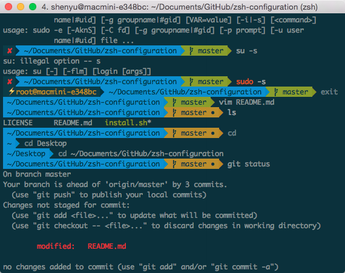

# 我的 zshrc 配置

## 使用截图

[iTerm2](https://github.com/gnachman/iTerm2) + [Oh My Zsh](https://github.com/robbyrussell/oh-my-zsh/) 使用效果



## 具体说明

Mac 自带Terminal对配色支持十分差，推荐使用 [iTerm2](https://github.com/gnachman/iTerm2)

* 修改主题为 `agnoster`

	```shell
	ZSH_THEME="agnoster"
	```
	需要安装 [Powerline fonts](https://github.com/powerline/fonts) 字体，否则无法显示agnoster主题的特殊字符

* 配置默认用户

	```shell
	export DEFAULT_USER="shenyu"
	```

* 配置插件

	```shell
	plugins=(git yii2 composer brew npm gem svn)
	```

* 设置语言环境

	```shell
	export LANG=zh_CN.UTF-8
	```

* 配置命令别名

	```
	alias ls="ls -FhOT"
	alias ll="ls -lFhOT"
	alias la="ls -alFhOT"
	alias rm="rm -i"
	alias cp="cp -i"
	alias mv="mv -i"
	alias mkdir="mkdir -v"
	```

* ls彩色化显示

	```shell
	export CLICOLOR=1
	export LSCOLORS=gxfxaxdxcxegedabagacad
	```

* 高亮特定命令

	```shell
	setopt extended_glob
	TOKENS_FOLLOWED_BY_COMMANDS=('|' '||' ';' '&' '&&' 'sudo' 'do' 'time' 'strace')

	recolor-cmd() {
		region_highlight=()
		colorize=true
		start_pos=0
		for arg in ${(z)BUFFER}; do
			((start_pos+=${#BUFFER[$start_pos+1,-1]}-${#${BUFFER[$start_pos+1,-1]## #}}))
			((end_pos=$start_pos+${#arg}))
			if $colorize; then
				colorize=false
				res=$(LC_ALL=C builtin type $arg 2>/dev/null)
				case $res in
					*'reserved word'*)
						style="fg=magenta,bold";;
					*'alias for'*)
						style="fg=cyan,bold";;
					*'shell builtin'*)
						style="fg=yellow,bold";;
					*'shell function'*)
						style='fg=green,bold';;
					*"$arg is"*)
						[[ $arg = 'sudo' ]] && style="fg=red,bold" || style="fg=blue,bold";;
					*)
						style='none,bold';;
				esac
				region_highlight+=("$start_pos $end_pos $style")
			fi
			[[ ${${TOKENS_FOLLOWED_BY_COMMANDS[(r)${arg//|/\|}]}:+yes} = 'yes' ]] && colorize=true
			start_pos=$end_pos
		done
	}

	check-cmd-self-insert() { zle .self-insert && recolor-cmd }
	check-cmd-backward-delete-char() { zle .backward-delete-char && recolor-cmd }

	zle -N self-insert check-cmd-self-insert
	zle -N backward-delete-char check-cmd-backward-delete-char
	```

## 一键安装 oh-my-zsh

```shell
curl -L https://raw.github.com/chrisniael/zsh-configuration/master/install.sh | sh
```

执行上面的命令，会自动安装 *oh my zsh*, 以及部署我自定义的 [.zhsrc](.zshrc) 配置。
